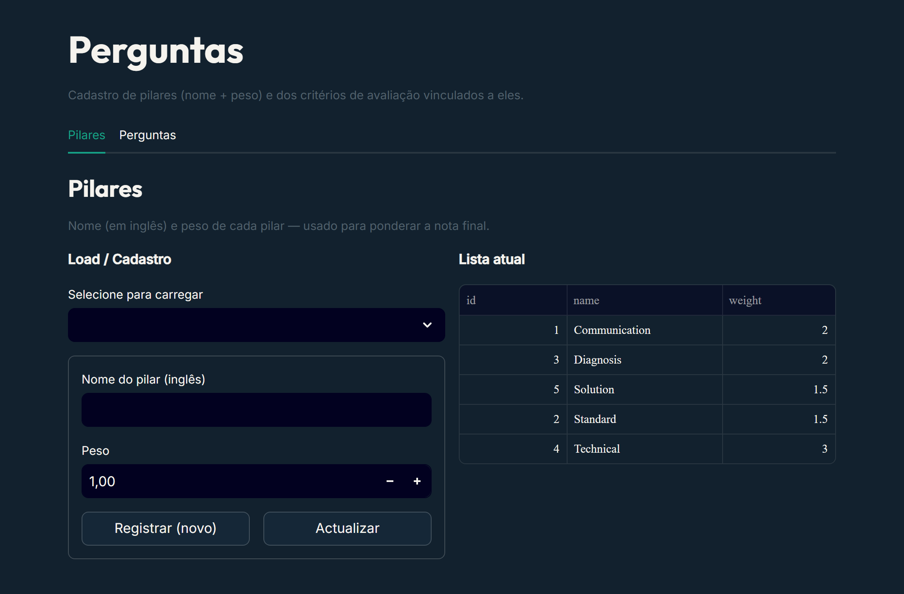
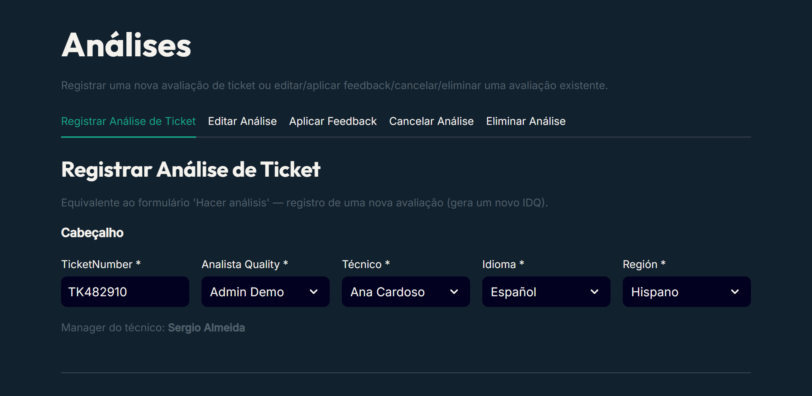
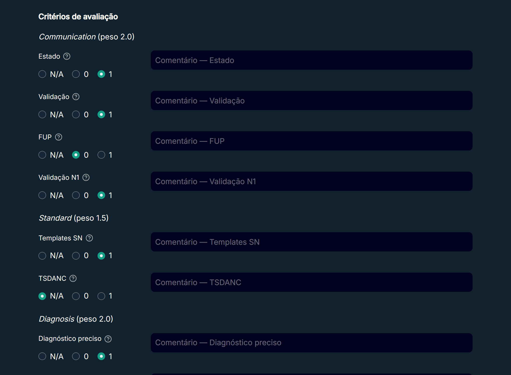
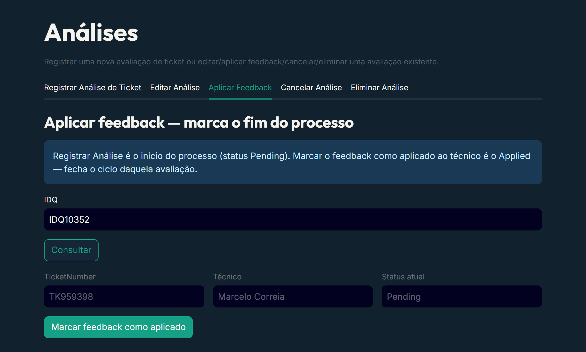
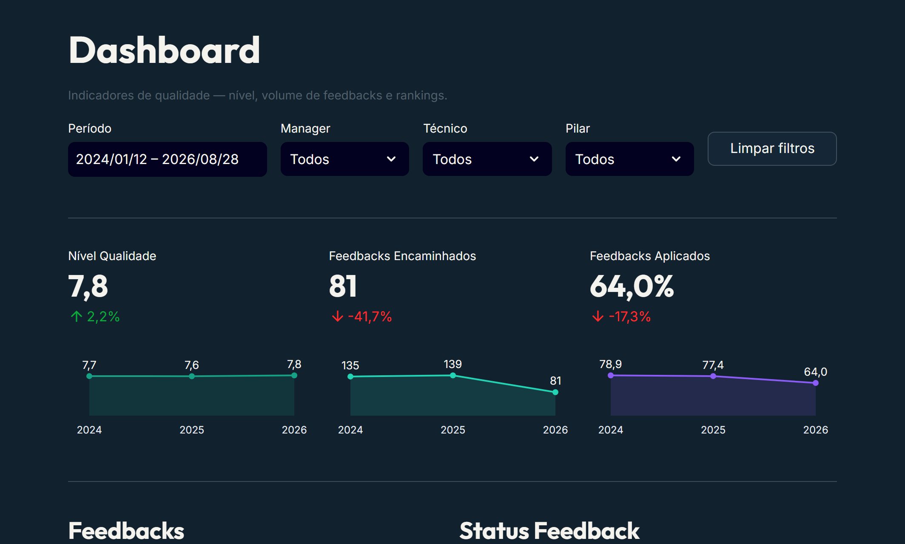
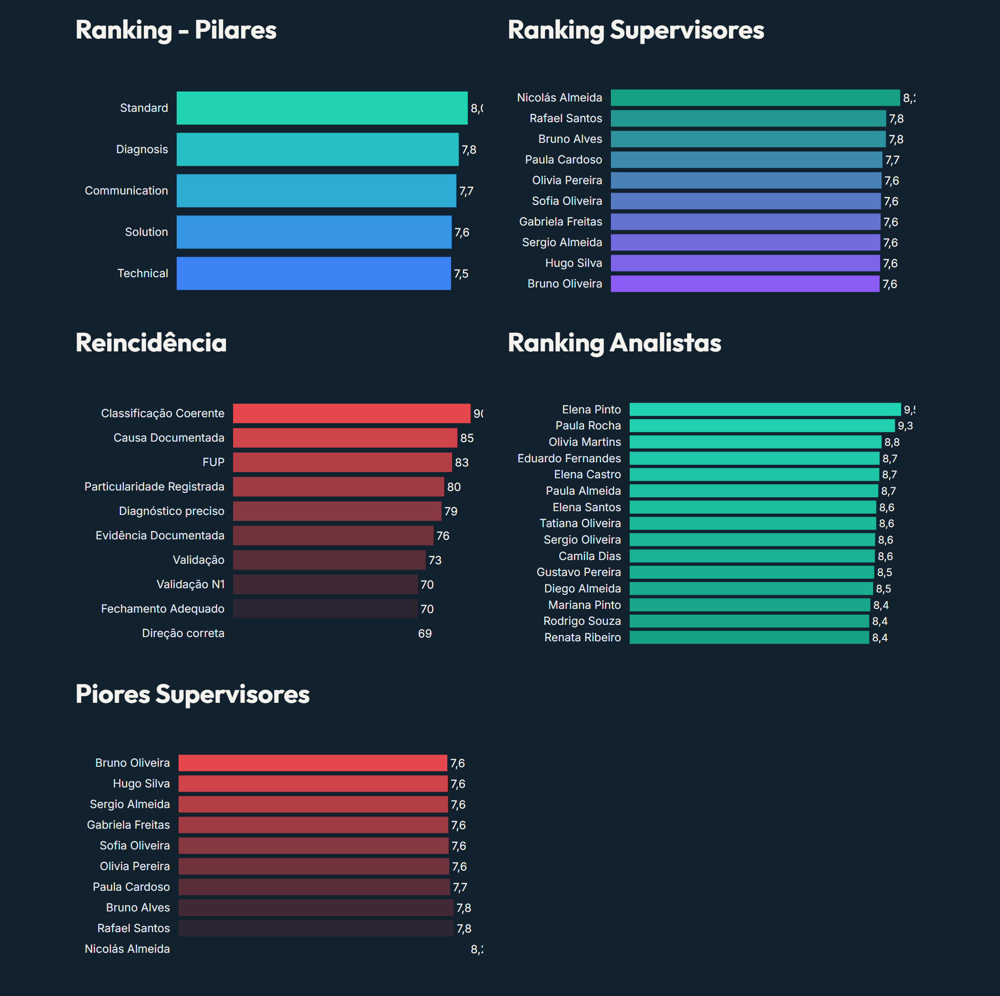
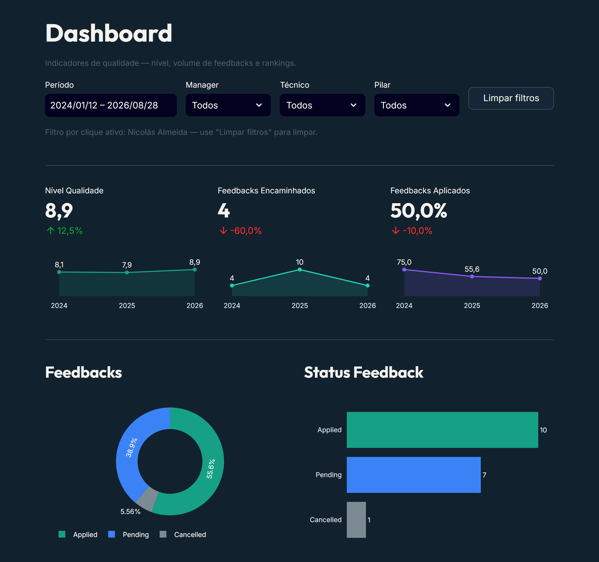
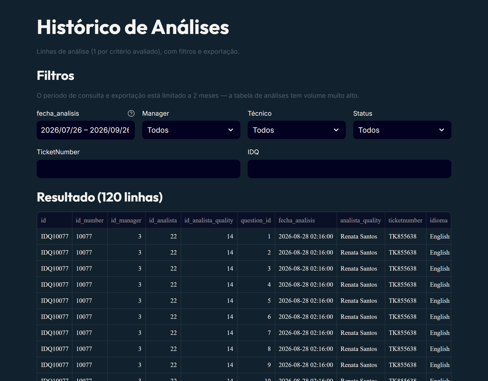

# Manual de uso — Quality System

Da instalação ao uso real. Os prints usam dados **fictícios de demonstração**.

**Índice**

1. [Para que serve](#1-para-que-serve)
2. [Instalação](#2-instalação)
3. [Primeiro acesso](#3-primeiro-acesso)
4. [Conceitos que você precisa saber](#4-conceitos-que-você-precisa-saber)
5. [Passo a passo do uso real](#5-passo-a-passo-do-uso-real)
6. [Dashboard: como ler](#6-dashboard-como-ler)
7. [Histórico e exportação](#7-histórico-e-exportação)
8. [Perfis e permissões](#8-perfis-e-permissões)
9. [Manutenção e backup](#9-manutenção-e-backup)
10. [Problemas comuns](#10-problemas-comuns)
11. [Limitações conhecidas](#11-limitações-conhecidas)

---

## 1. Para que serve

O Quality System recolhe dados sobre a **qualidade do serviço prestado** e ajuda o **manager** a gerir o próprio time: em quais pilares e critérios o time falha, quais técnicos precisam de apoio e se o feedback chegou a ser dado.

O fluxo inteiro em uma linha:

```
Analista registra a avaliação → feedback nasce Pending → é aplicado ao técnico (Applied)
                                                       ↘ ou descartado (Cancelled)
                     Dashboard e Histórico mostram tudo, por período, manager, técnico e pilar
```

## 2. Instalação

Escolha **uma** opção. Docker é o caminho mais simples; a instalação local serve para desenvolver ou testar.

### Opção A: Docker (recomendado)

Pré-requisito: [Docker Desktop](https://www.docker.com/products/docker-desktop/) (ou Docker Engine + Compose).

```bash
git clone https://github.com/leonardo-beranger/quality-system.git
cd quality-system
cp .env.example .env          # opcional: só define a porta (QUALITY_PORT)
docker compose up -d --build
```

Abra **http://localhost:8502**. A porta padrão do host é 8502 (a 8501 costuma estar ocupada); mude com `QUALITY_PORT` no `.env`.

- O banco SQLite fica no volume Docker `quality-data`. Ele sobrevive a `docker compose down`, a rebuilds e a reinícios.
- Comandos úteis:

```bash
docker compose logs -f        # acompanhar logs
docker compose restart        # reiniciar
docker compose down           # parar e remover o container (o volume com o banco continua)
```

**Acesso por outros computadores da rede:** a porta é publicada em `0.0.0.0`, então o app responde em `http://<IP-do-host>:8502`. No Windows é preciso liberar a porta no firewall (PowerShell **como administrador**):

```powershell
New-NetFirewallRule -DisplayName "Quality Streamlit 8502" -Direction Inbound -Protocol TCP -LocalPort 8502 -Action Allow -Profile Any -RemoteAddress LocalSubnet
```

**Acesso pela internet (opcional, só para demonstração):** o perfil `tunnel` sobe um Quick Tunnel da Cloudflare com uma URL pública `trycloudflare.com` (muda a cada subida). Não há proteção além do login do app.

```bash
docker compose --profile tunnel up -d
docker compose logs cloudflared | grep trycloudflare
```

### Opção B: instalação local (sem Docker)

Pré-requisito: Python 3.12.

```bash
git clone https://github.com/leonardo-beranger/quality-system.git
cd quality-system
python -m venv .venv
.venv\Scripts\activate           # Windows
# source .venv/bin/activate      # Linux / macOS
pip install -r requirements.txt
streamlit run Inicio.py
```

Abra **http://localhost:8501**. Na primeira execução o app cria o arquivo `quality_system.db` na raiz do projeto, com todas as tabelas e o catálogo padrão de 5 pilares e 15 critérios.

**Onde fica o banco:** por padrão em `quality_system.db`, na raiz. Para mudar, copie `db_config.json.example` para `db_config.json` e ajuste o caminho (relativo à raiz ou absoluto), ou use a variável de ambiente `QUALITY_DB_PATH`. Depois de editar o `db_config.json`, use o botão **Recargar configuración** na página Início.

> **Não deixe o banco numa pasta sincronizada** (OneDrive, Dropbox, Google Drive). O SQLite grava arquivos auxiliares (`.db-wal` e `.db-shm`) o tempo todo, e a sincronização pode corromper ou perder dados. Aponte o `db_config.json` para uma pasta local fora da sincronização.

## 3. Primeiro acesso

Um banco novo tem o catálogo de pilares e critérios, mas **nenhum usuário**. Crie o primeiro admin pela linha de comando (na raiz do projeto):

```bash
python scripts/create_admin.py --email voce@empresa.com --name "Seu Nome" --password "UmaSenhaForte"
```

No Docker:

```bash
docker compose exec quality python scripts/create_admin.py --email voce@empresa.com --name "Seu Nome" --password "UmaSenhaForte"
```

- Sem `--password`, a senha é a padrão `quality_{ano_atual}` (ex.: `quality_2026`).
- **Defina uma senha própria no admin.** Não existe tela de troca de senha no app (ver [Limitações](#11-limitações-conhecidas)).
- O script não sobrescreve nada: se o e-mail já existir, ele aborta.

**Dados de demonstração (opcional).** Para explorar o app com dados prontos, num banco **vazio** (só com o admin criado):

```bash
python scripts/seed_demo_data.py
```

Gera 10 supervisores, 100 técnicos, 13 contas viewer e 300 a 700 avaliações fictícias, de 2024-01 a 2026-08. Só adiciona: se já houver supervisores ou técnicos, aborta sem alterar nada. As contas viewer criadas usam a senha padrão `quality_{ano_atual}`.

**Entrar.** Abra o endereço do app, informe e-mail e senha e clique em **Entrar**. A sessão sobrevive a recarregar a página (F5). Para sair, use o botão **Sair** na barra lateral.

**Idioma.** Na barra lateral, escolha Spanish, Portuguese ou English. O idioma vale para todas as páginas da sessão.

## 4. Conceitos que você precisa saber

| Conceito | O que é |
|---|---|
| **Pilar** | Grupo de critérios, com um **peso**. Nome em inglês. Padrão: Technical (3,0), Communication (2,0), Diagnosis (2,0), Standard (1,5), Solution (1,5). |
| **Critério (pergunta)** | Item avaliado, ligado a um pilar. Herda o peso do pilar. Texto em português. Pode ser ativado ou desativado. |
| **Avaliação (IDQ)** | Uma análise de ticket. Recebe um código `IDQ` (ex.: `IDQ10352`). Guarda uma nota por critério. |
| **Nota do critério** | `1` (atendeu), `0` (falhou) ou `N/A` (não se aplica; sai da conta). |
| **Status do feedback** | `Pending` (registrada, feedback ainda não aplicado), `Applied` (feedback aplicado ao técnico), `Cancelled` (avaliação fora do ciclo). |
| **Nível de Qualidade** | Nota de 0 a 10 calculada pelo sistema (abaixo). |

**Como a nota é calculada**

```
Nível de Qualidade = Σ (nota × peso do pilar) ÷ Σ (pesos dos critérios respondidos) × 10
```

- Critérios `N/A` **não entram** no numerador nem no denominador.
- O peso é por critério (herdado do pilar), não uma média de médias de pilares.
- Exemplo com os 15 critérios padrão respondidos (soma dos pesos = 30,5):
  - falhou 1 critério de Technical: (30,5 − 3) ÷ 30,5 × 10 = **9,0**;
  - falhou 1 critério de Communication: (30,5 − 2) ÷ 30,5 × 10 = **9,3**;
  - o critério de Technical foi `N/A` e o resto passou: **10,0**.
- A mesma fórmula vale em todos os recortes do Dashboard: ano, mês, pilar, supervisor e técnico.

## 5. Passo a passo do uso real

### 5.1 Cadastros (admin)

Menu **Cadastros**, com três abas:

1. **Quality Agent:** os usuários do sistema (admin ou viewer). Informe nome, e-mail, status e perfil. O usuário novo entra com a senha padrão `quality_{ano}`, que o admin precisa comunicar.
2. **Manager:** os supervisores (tabela de referência).
3. **Analistas (técnicos):** os técnicos avaliados, ligados a um manager, com região e status.

> Manager e usuário são **dois cadastros distintos** que só coincidem em nome e e-mail. Para um supervisor entrar no sistema, cadastre-o nas duas abas: em **Manager** (para aparecer nos filtros e relatórios) e em **Quality Agent** com perfil `viewer` (para ter login).

Para editar, selecione o registro na lista, altere e clique em **Actualizar**. Para criar, preencha e clique em **Registrar (novo)**.

### 5.2 Pilares e perguntas (admin)

Menu **Perguntas**, com duas abas.



- **Pilares:** nome (em inglês) e **peso**. Mudar o peso muda a nota de todas as avaliações no Dashboard.
- **Perguntas:** cada critério pertence a um pilar. Você pode criar, editar e **ativar/desativar**. Só as perguntas ativas entram em avaliações **novas**. Uma pergunta desativada continua aparecendo, para edição, nas avaliações que já a responderam.

### 5.3 Registrar uma avaliação (admin e viewer)

Menu **Análises → Registrar Análise de Ticket**. Esta é a **primeira etapa** do ciclo.



1. No cabeçalho, preencha **TicketNumber**, **Analista Quality**, **Técnico**, **Idioma** e **Região**. Ao escolher o técnico, o app mostra o manager dele.
2. Em **Critérios de avaliação**, marque `N/A`, `0` ou `1` para cada critério, agrupados por pilar (o peso aparece ao lado do nome do pilar). Se quiser, escreva um comentário por critério.



3. Salve. O sistema gera um novo **IDQ** e grava a avaliação com status **Pending**.

### 5.4 Aplicar o feedback (admin e viewer)

Menu **Análises → Aplicar Feedback**. Esta é a **última etapa** do ciclo: fechar a avaliação depois que o feedback foi repassado ao técnico.



1. Informe o **IDQ** e clique em **Consultar**. O app mostra o ticket, o técnico e o status atual.
2. Clique em **Marcar feedback como aplicado**. O status passa de `Pending` para `Applied`.

O botão só aparece se a avaliação estiver `Pending`. Se já estiver `Applied` ou `Cancelled`, o app avisa e não deixa aplicar de novo.

O perfil viewer (por exemplo, o supervisor) também acessa esta aba, para confirmar que o feedback chegou ao técnico sem precisar de acesso admin.

### 5.5 Corrigir, cancelar ou eliminar (admin)

Ainda em **Análises**, três abas exclusivas do admin:

| Aba | O que faz | Reversível? |
|---|---|---|
| **Editar Análise** | Localiza uma avaliação por IDQ, TicketNumber ou técnico e altera notas e comentários. | Sim (edite de novo). |
| **Cancelar Análise** | Marca a avaliação como `Cancelled` e grava o **motivo**. Mantém o histórico e tira a avaliação do ciclo normal. | Mantém tudo; só muda o status. |
| **Eliminar Análise** | **Apaga definitivamente** as linhas do IDQ. Use só para lançamentos indevidos. | **Não.** |

Prefira **Cancelar** a **Eliminar**: cancelar preserva o histórico.

Toda alteração é gravada na tabela de auditoria `activity_log`, com uma linha por coluna alterada.

## 6. Dashboard: como ler

Menu **Dashboard** (admin e viewer).



**Filtros no topo:** Período, Manager, Técnico e Pilar. Eles atuam uns sobre os outros: ao escolher um Manager, a lista de Técnicos mostra só o time dele. **Limpar filtros** volta ao padrão.

**Indicadores (por ano, com variação contra o ano anterior):**

- **Nível Qualidade:** a nota de 0 a 10 descrita na [seção 4](#4-conceitos-que-você-precisa-saber).
- **Feedbacks Encaminhados:** total de avaliações no recorte.
- **Feedbacks Aplicados:** % das avaliações **não canceladas** com status `Applied`.

**Gráficos:** distribuição e status dos feedbacks, evolução mensal (encaminhados, aplicados e nível de qualidade) e os rankings.



- **Ranking Pilares, Supervisores e Analistas (técnicos):** ordenados por Nível de Qualidade.
- **Piores Supervisores:** os supervisores com menor nível.
- **Reincidência:** as perguntas (critérios) com mais notas `0`, ou seja, onde o problema mais se repete. É o gráfico que mostra ao manager **o que melhorar**.

**Filtro por clique.** Clique em uma barra (por exemplo, um supervisor) e todo o dashboard é filtrado por ela. O app mostra o aviso "Filtro por clique ativo" e o botão **Limpar filtros** remove o filtro.



## 7. Histórico e exportação

Menu **Histórico de Análises** (admin e viewer). Mostra as avaliações **linha a linha** (uma linha por critério avaliado).



- **Filtros:** Período, Manager, Técnico (em cascata), Status (`Pending`, `Applied`, `Cancelled`), TicketNumber e IDQ.
- **Limite de período:** a consulta e a exportação aceitam **no máximo 2 meses** por vez. Um período maior é recortado automaticamente, com aviso na tela. Há também um teto de linhas por consulta.
- **Exportar CSV / Exportar Excel:** baixa exatamente as linhas mostradas, com as colunas da tabela `ticket_analysis`.
- O resultado é guardado em cache por 5 minutos, e qualquer gravação (registrar, editar, aplicar, cancelar, eliminar) limpa esse cache.

## 8. Perfis e permissões

| Página / aba | admin | viewer |
|---|:-:|:-:|
| Início | ✔ | ✔ |
| Dashboard | ✔ | ✔ |
| Cadastros | ✔ | ✖ |
| Perguntas | ✔ | ✖ |
| Análises → Registrar | ✔ | ✔ |
| Análises → Aplicar Feedback | ✔ | ✔ |
| Análises → Editar / Cancelar / Eliminar | ✔ | ✖ |
| Histórico de Análises | ✔ | ✔ |

A restrição é aplicada em cada página, então digitar a URL diretamente não contorna as permissões.

**Mudar o perfil de um usuário** (por exemplo, de viewer para admin): em **Cadastros → Quality Agent**, selecione o usuário, altere o campo de perfil e clique em **Actualizar**.

## 9. Manutenção e backup

**Backup.** Todo o dado está em **um arquivo** SQLite.

- **Local:** com o app **parado**, copie `quality_system.db` (ou o caminho do seu `db_config.json`). Se existirem `quality_system.db-wal` e `quality_system.db-shm` ao lado, copie os três juntos e **não apague nenhum deles**: dados recentes podem estar só no `-wal`.
- **Docker:** o banco está no volume `quality-data`. Com o container parado, copie o arquivo do volume, por exemplo:

```bash
docker compose stop
docker run --rm -v quality-streamlit_quality-data:/data -v "$PWD":/backup alpine cp /data/quality_system.db /backup/
docker compose start
```

O nome do volume é o prefixo do projeto Compose mais `quality-data`. Confira com `docker volume ls`.

**Atualizar o app.**

```bash
git pull
docker compose up -d --build        # Docker
# ou, local: pip install -r requirements.txt e reinicie o streamlit
```

O banco é preservado. O schema é criado e atualizado automaticamente na primeira conexão.

**Encerrar.** `docker compose down` para o container sem apagar o volume. Só `docker compose down -v` apaga o banco, e não tem volta.

## 10. Problemas comuns

| Sintoma | Causa provável | O que fazer |
|---|---|---|
| Não consigo entrar | Não existe usuário no banco novo, ou e-mail/senha incorretos. | Crie o admin com `scripts/create_admin.py` (seção 3). A senha padrão é `quality_{ano}`. |
| A página Início mostra erro de banco | Arquivo inacessível, bloqueado por outro processo ou somente leitura. | Leia a causa provável mostrada na tela, corrija o caminho ou a permissão e clique em **Recargar configuración**. |
| Mudei o `db_config.json` e nada mudou | O app guarda a conexão em cache. | Clique em **Recargar configuración** na página Início ou reinicie o app. |
| Dados sumiram ou o banco corrompeu | Banco em pasta sincronizada (OneDrive etc.) ou arquivos `-wal`/`-shm` apagados à mão. | Restaure o backup e mova o banco para fora da pasta sincronizada. Nunca apague `-wal`/`-shm`. |
| O Histórico mostra menos dados do que esperado | Limite de 2 meses por consulta. | Consulte o período em blocos de até 2 meses. |
| Outros computadores não acessam | Firewall ou porta errada. | Libere a porta 8502 (seção 2) e use `http://<IP-do-host>:8502`. |
| Porta em uso ao subir o Docker | Outro serviço usa a 8502. | Mude `QUALITY_PORT` no `.env` e rode `docker compose up -d`. |
| O Dashboard está vazio | Ainda não há avaliações no período. | Registre avaliações ou rode o `seed_demo_data.py` num banco vazio. |

## 11. Limitações conhecidas

- **Sem tela de troca ou recuperação de senha.** Usuários criados em Cadastros entram com a senha padrão `quality_{ano}`, que é previsível, e o app não oferece como alterá-la. Use o app numa rede confiável e defina uma senha própria ao criar o admin (`--password`). Só o script `create_admin.py` aceita senha personalizada.
- **SQLite:** ótimo para um time pequeno e para começar (zero infraestrutura). Escrita concorrente intensa, com muitos usuários gravando ao mesmo tempo, pede um banco de servidor como o PostgreSQL.
- **Volume de dados:** o Histórico limita a consulta a 2 meses por vez, por causa do volume.
- **Critérios em português:** o texto dos critérios e comentários é dado do catálogo, não muda com o idioma da interface. Os nomes dos pilares e os status são sempre em inglês.
- **Contas separadas:** manager (referência) e usuário (login) são cadastros independentes; é preciso criar os dois para um supervisor que também precisa entrar.
